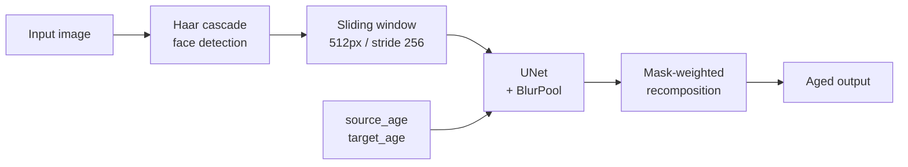

# Face Aging AI

Age progression and regression for faces, served as a FastAPI endpoint. Give
it a photograph, the subject's current age, and a target age; it returns the
same face rendered at that age.

The model is a custom PyTorch UNet with anti-aliased downsampling, applied
through a sliding window so full-resolution images keep their detail.

## Demo

<p align="center">
  
  
</p>
<p align="center">
  
  
</p>

Video re-aging is supported through the same model applied frame by frame:

<p align="center">
  
  
  
</p>

## How it works



Source and target ages are fed to the network alongside the image, so one
model handles both progression and regression rather than needing a separate
model per age bracket.

Large images are processed in overlapping 512-pixel windows with a stride of
256. Overlapping regions are blended using the precomputed masks in
`assets/`, which avoids the seams a naive tiling would leave behind.

The generator uses `antialiased_cnns.BlurPool` in its downsampling path.
Standard strided convolutions alias under translation, which on a face model
shows up as detail that shimmers when the input shifts by a pixel — blurred
pooling suppresses that.

## Architecture

```text
main.py                    FastAPI application and /predict endpoint
core/
  model_loader.py          Checkpoint and mask loading
  inference.py             Image and video prediction wrappers
  main.py                  Core entry helpers
model/
  models.py                UNet definition with anti-aliased down/up layers
scripts/
  test_functions.py        Sliding-window inference and face detection
assets/
  mask512.jpg              Blending mask for the 512px window
  mask1024.jpg             Blending mask for the 1024px window
  docs/                    Demo GIFs
  gradio_example_images/   Sample inputs
best_unet_model.pth        Trained weights (Git LFS, ~121 MB)
```

## API

`GET /` — health check, returns `{"status": "ok"}`.

`POST /predict` — multipart form:

| Field | Type | Meaning |
|---|---|---|
| `file` | file | Image to re-age (any `image/*` type) |
| `source_age` | int | Subject's current age |
| `target_age` | int | Age to render |

Responds with `{"image_url": "/images/<uuid>.png"}`; the generated file is
served from the mounted `/images` route.

```bash
curl -X POST http://localhost:7860/predict \
  -F "file=@assets/gradio_example_images/1.png" \
  -F "source_age=35" \
  -F "target_age=60"
```

## Installation

The weights are stored in Git LFS, so install it before cloning:

```bash
git lfs install
```

```bash
git clone https://github.com/ahmedsayed1911/face-aging-ai.git
```

```bash
pip install -r requirements.txt
```

## Running

```bash
python main.py
```

The service listens on port 7860. CUDA is used when available and the model
falls back to CPU otherwise, where inference is substantially slower.

## Limitations

- Face detection uses a Haar cascade, which is fast but misses profile views,
  heavy occlusion, and poor lighting more often than a modern detector would.
- Results degrade for very large age gaps and for faces far from the training
  distribution.
- Video is processed frame by frame with no temporal consistency term, so
  output can flicker between frames.
- No quantitative evaluation of age accuracy or identity preservation is
  published in this repository.
